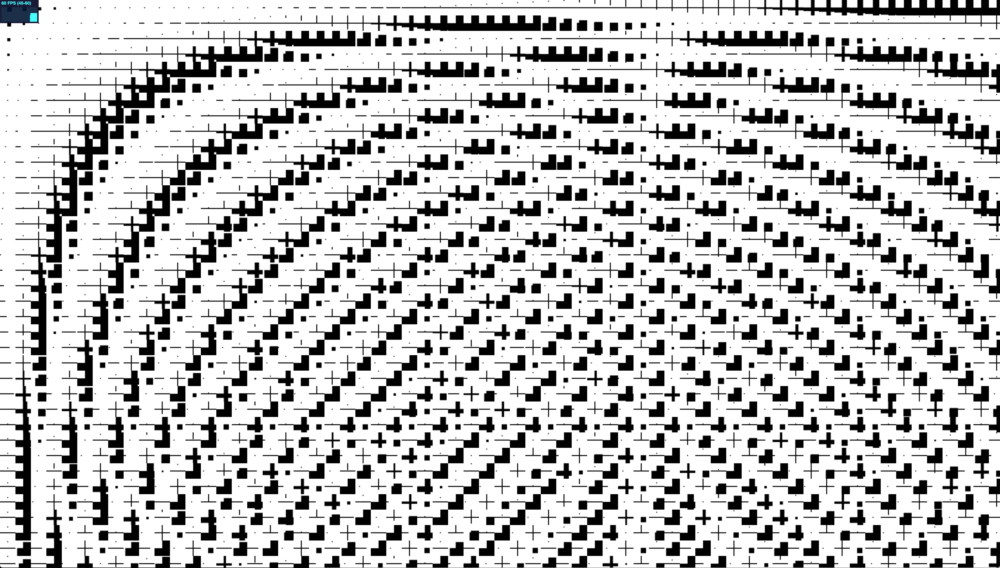
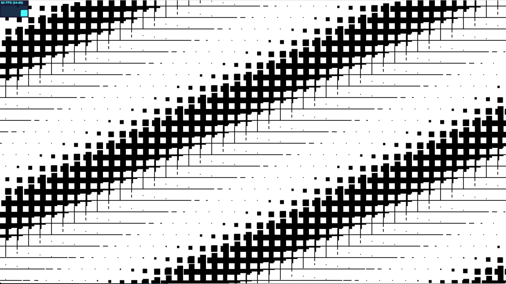
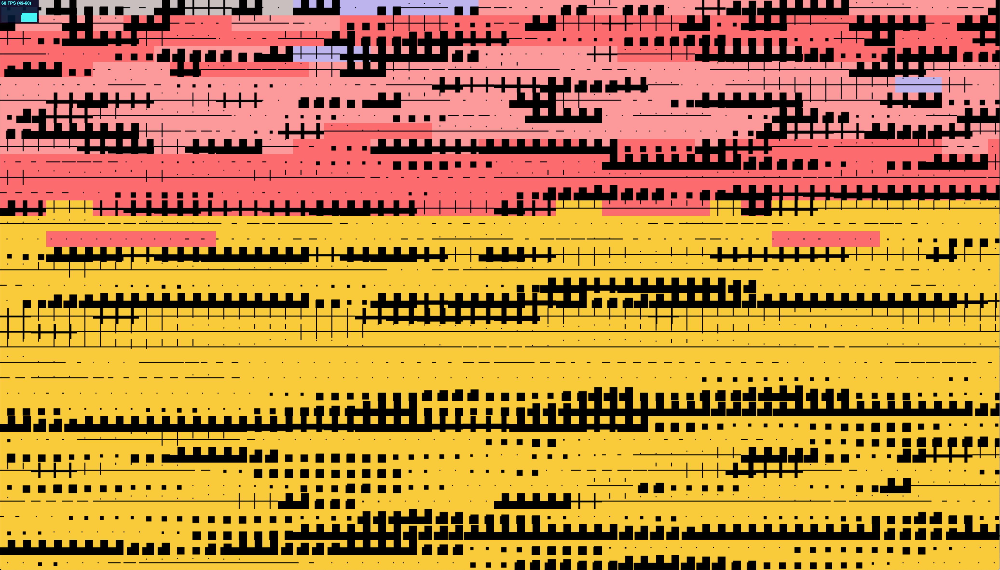

# Proto - Pixi - AnimatedSprites

[PixiJS](https://pixijs.io) prototypes using AnimatedSprites, Spritesheet. 

## Scripts

### `npm i`

Install dependencies:

### `npm start`

Access via [http://localhost:3000](http://localhost:3000)

### `npm run build`
Build all prototypes into dist folder

To build specific prototypes into a dist folder use:

`npm run build [proto number]`

Example to build protos 01 13, 31 and 50 just use spaces:

`npm run build 13 31 50`

### `npm run index`
Generate the index.html with a list of links for each prototype.

---

